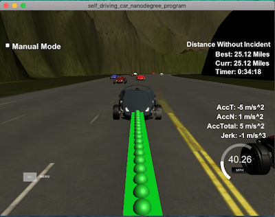
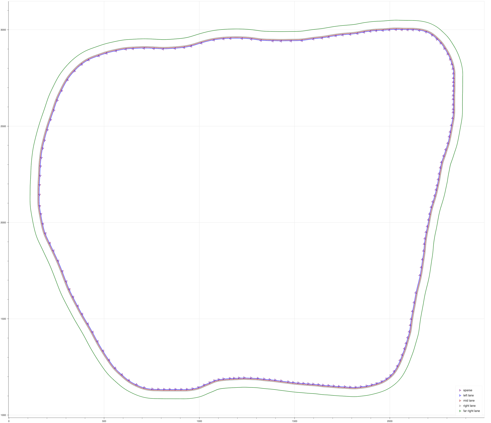

## <a name="top"></a> Path Planning Project [](https://www.udacity.com/course/self-driving-car-engineer-nanodegree--nd013)

### [Project Rubric](https://review.udacity.com/#!/rubrics/1020/view)
#### Compilation
Project compiles successfully. To compile from scratch:
 * `cd build`
 * `cmake .. && make`
 * `./path_planning`
 * start simulator

#### Valid Trajectories

 * The car is able to drive at least 4.32 miles without incident. My car
 had a success of driving over 25 miles without an incident
 * The car drives according to the speed limit.
 * Max Acceleration and Jerk are not Exceeded.
 * Car does not have collisions.
 * The car stays in its lane, except for the time between changing lanes.
 * The car is able to change lanes

#### Reflection
The project consists of three parts: Prediction, Behavior, Trajectory.

##### Prediction
In this part we work with telemetry and sensor fusion data.
We receive `vx` and `vy` from sensor fusion and use `car_s` values to
determine if there is a car on left or right, or in front or in the back
in dangerous proximity.
I used value of 30 m, this is what we used during lectures, to determine
safe distance to the car in the from or in the back.
A function the does calculation for prediction is located in `main.cpp`, it's
```c++
void calculate_prediction(vector<vector<double>> &sensor_fusion, Vehicle &my_car, double lane, int prev_size)
```
The function determines the lane of each car and the position of the car
during last planed trajectory.
Simulator has three lanes, each lane determined by looking at the value `d`
from data from sensor_fusion.
`d` can range from 0 to 12. Each lane costs 4 points. If 0 < `d` < 4:
car is in lane 0, first from the right, 4 < `d` < 8: car is in the lane 1,
middle lane and 8 < `d` < 12: car is in lane 2, far left lane.

If there is a car within 30 m distanse from `my_car`, we set `my_car.car_right`
to `true`, possible fields: `(car_left, car_right, in_lane)`.

##### Behavior
In this part we calculate and make a decision if we increase or decrease
speed and if we change lanes.
Code responsible for it
```c++
void plan_behaviour(Vehicle &my_car, int &lane, double &speed_diff, double ref_vel)
```
This function executes the following logic, if the car is in front or in
the back, do we slow down or can we safely change lane to avoid collision.
The priority is given to a center lane, if the car in left or right lane
and the center lane is free, it will try to merge into the center lane
and increase speed if it's save and the current speed is below `MAX_SPEED = 49.5`.

##### Trajectory
In this part we calculate trajectory of the car given calculated behavior,
current speed past way points and car coordinates.
If the car just started to move and does not have at least two trajectory points
use car's current `car_s` and `yaw` to determine second point.
```c++
double prev_car_x = my_car.car_x - cos(my_car.car_yaw);
double prev_car_y = my_car.car_y - sin(my_car.car_yaw);
```
`yaw` came in `deg`, convert it to `rad` before calculations.
If car has more than 2 trajectory points, use last two to trajectory points.

Car is using `(x, y)` coordinates. To calculate three trajectory points in the future
I used `getXY` function. I passed into the function coordinates: `map_waypoints_s`,
`map_waypoints_x` and `map_waypoints_y` in Frenet and spaced
trajectory points by 30m into the future. The `getXY` function returned
three sets of `(x, y)` coordinates.
Before passing it into the car I had to convert it from local to car coordinates by
using formula:
```c++
    double shift_x = ptsx[i] - ref_x;
    double shift_y = ptsy[i] - ref_y;

    ptsx[i] = shift_x * cos(0 - ref_yaw) - shift_y * sin(0 - ref_yaw);
    ptsy[i] = shift_x * sin(0 - ref_yaw) + shift_y * cos(0 - ref_yaw);
```
As suggested in lectures I used `spline` library to make trajectory smoother.
I passed an array of three `x` and `y` points.
```c++
    tk::spline s;
    s.set_points(ptsx, ptsy);
```

##### Data Analysis
During 25 mile run I have collected data in `../data/highway_map.csv`.
I have ran into several crashes and speed violations during the course of development of this project.
Collected data helped me analyze and understand the problem and fix it.
To look at the collected data I have build a graphical output in Python notebook in tools directory.
Here is a graph of the loop of the track.




---------------------
### Simulator.
You can download the Term3 Simulator which contains the Path Planning Project from the [releases tab](https://github.com/udacity/self-driving-car-sim/releases).

### Goals
In this project your goal is to safely navigate around a virtual highway with other traffic that is driving +-10 MPH of the 50 MPH speed limit. You will be provided the car's localization and sensor fusion data, there is also a sparse map list of waypoints around the highway. The car should try to go as close as possible to the 50 MPH speed limit, which means passing slower traffic when possible, note that other cars will try to change lanes too. The car should avoid hitting other cars at all cost as well as driving inside of the marked road lanes at all times, unless going from one lane to another. The car should be able to make one complete loop around the 6946m highway. Since the car is trying to go 50 MPH, it should take a little over 5 minutes to complete 1 loop. Also the car should not experience total acceleration over 10 m/s^2 and jerk that is greater than 10 m/s^3.

#### The map of the highway is in data/highway_map.txt
Each waypoint in the list contains  [x,y,s,dx,dy] values. x and y are the waypoint's map coordinate position, the s value is the distance along the road to get to that waypoint in meters, the dx and dy values define the unit normal vector pointing outward of the highway loop.

The highway's waypoints loop around so the frenet s value, distance along the road, goes from 0 to 6945.554.

## Basic Build Instructions

1. Clone this repo.
2. Make a build directory: `mkdir build && cd build`
3. Compile: `cmake .. && make`
4. Run it: `./path_planning`.

Here is the data provided from the Simulator to the C++ Program

#### Main car's localization Data (No Noise)

["x"] The car's x position in map coordinates
["y"] The car's y position in map coordinates
["s"] The car's s position in frenet coordinates
["d"] The car's d position in frenet coordinates
["yaw"] The car's yaw angle in the map
["speed"] The car's speed in MPH

#### Previous path data given to the Planner

//Note: Return the previous list but with processed points removed, can be a nice tool to show how far along
the path has processed since last time. 

["previous_path_x"] The previous list of x points previously given to the simulator
["previous_path_y"] The previous list of y points previously given to the simulator

#### Previous path's end s and d values 

["end_path_s"] The previous list's last point's frenet s value
["end_path_d"] The previous list's last point's frenet d value

#### Sensor Fusion Data, a list of all other car's attributes on the same side of the road. (No Noise)

["sensor_fusion"] A 2d vector of cars and then that car's [car's unique ID,
car's x position in map coordinates, car's y position in map coordinates,
car's x velocity in m/s, car's y velocity in m/s, car's s position in frenet
coordinates, car's d position in frenet coordinates.

## Details

1. The car uses a perfect controller and will visit every (x,y) point it
recieves in the list every .02 seconds. The units for the (x,y) points are
in meters and the spacing of the points determines the speed of the car.
The vector going from a point to the next point in the list dictates the
angle of the car. Acceleration both in the tangential and normal directions
is measured along with the jerk, the rate of change of total Acceleration.
The (x,y) point paths that the planner recieves should not have a total
acceleration that goes over 10 m/s^2, also the jerk should not go over
50 m/s^3. (NOTE: As this is BETA, these requirements might change.
Also currently jerk is over a .02 second interval, it would probably
be better to average total acceleration over 1 second and measure jerk from that.
2. There will be some latency between the simulator running and the path
planner returning a path, with optimized code usually its not very long
maybe just 1-3 time steps. During this delay the simulator will continue
using points that it was last given, because of this its a good idea to
store the last points you have used so you can have a smooth transition.
previous_path_x, and previous_path_y can be helpful for this transition
since they show the last points given to the simulator controller with
the processed points already removed. You would either return a path that
extends this previous path or make sure to create a new path that has a
smooth transition with this last path.

## Tips

A really helpful resource for doing this project and creating smooth
trajectories was using http://kluge.in-chemnitz.de/opensource/spline/,
the spline function is in a single hearder file is really easy to use.

---

## Dependencies

* cmake >= 3.5
 * All OSes: [click here for installation instructions](https://cmake.org/install/)
* make >= 4.1
  * Linux: make is installed by default on most Linux distros
  * Mac: [install Xcode command line tools to get make](https://developer.apple.com/xcode/features/)
  * Windows: [Click here for installation instructions](http://gnuwin32.sourceforge.net/packages/make.htm)
* gcc/g++ >= 5.4
  * Linux: gcc / g++ is installed by default on most Linux distros
  * Mac: same deal as make - [install Xcode command line tools]((https://developer.apple.com/xcode/features/)
  * Windows: recommend using [MinGW](http://www.mingw.org/)
* [uWebSockets](https://github.com/uWebSockets/uWebSockets)
  * Run either `install-mac.sh` or `install-ubuntu.sh`.
  * If you install from source, checkout to commit `e94b6e1`, i.e.
    ```
    git clone https://github.com/uWebSockets/uWebSockets 
    cd uWebSockets
    git checkout e94b6e1
    ```

## Editor Settings

We've purposefully kept editor configuration files out of this repo in order to
keep it as simple and environment agnostic as possible. However, we recommend
using the following settings:

* indent using spaces
* set tab width to 2 spaces (keeps the matrices in source code aligned)

## Code Style

Please (do your best to) stick to [Google's C++ style guide](https://google.github.io/styleguide/cppguide.html).

## Project Instructions and Rubric

Note: regardless of the changes you make, your project must be buildable using
cmake and make!


## Call for IDE Profiles Pull Requests

Help your fellow students!

We decided to create Makefiles with cmake to keep this project as platform
agnostic as possible. Similarly, we omitted IDE profiles in order to ensure
that students don't feel pressured to use one IDE or another.

However! I'd love to help people get up and running with their IDEs of choice.
If you've created a profile for an IDE that you think other students would
appreciate, we'd love to have you add the requisite profile files and
instructions to ide_profiles/. For example if you wanted to add a VS Code
profile, you'd add:

* /ide_profiles/vscode/.vscode
* /ide_profiles/vscode/README.md

The README should explain what the profile does, how to take advantage of it,
and how to install it.

Frankly, I've never been involved in a project with multiple IDE profiles
before. I believe the best way to handle this would be to keep them out of the
repo root to avoid clutter. My expectation is that most profiles will include
instructions to copy files to a new location to get picked up by the IDE, but
that's just a guess.

One last note here: regardless of the IDE used, every submitted project must
still be compilable with cmake and make./

## How to write a README
A well written README file can enhance your project and portfolio.  Develop your abilities to create professional README files by completing [this free course](https://www.udacity.com/course/writing-readmes--ud777).
